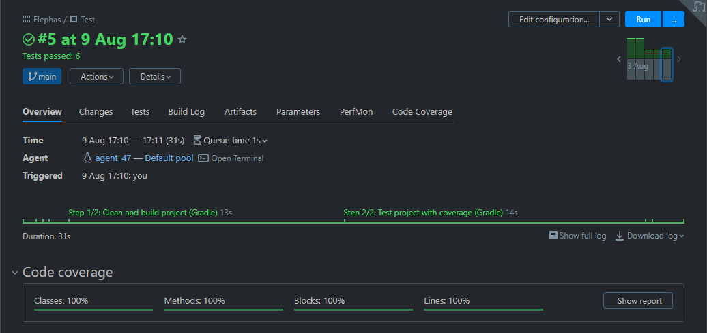
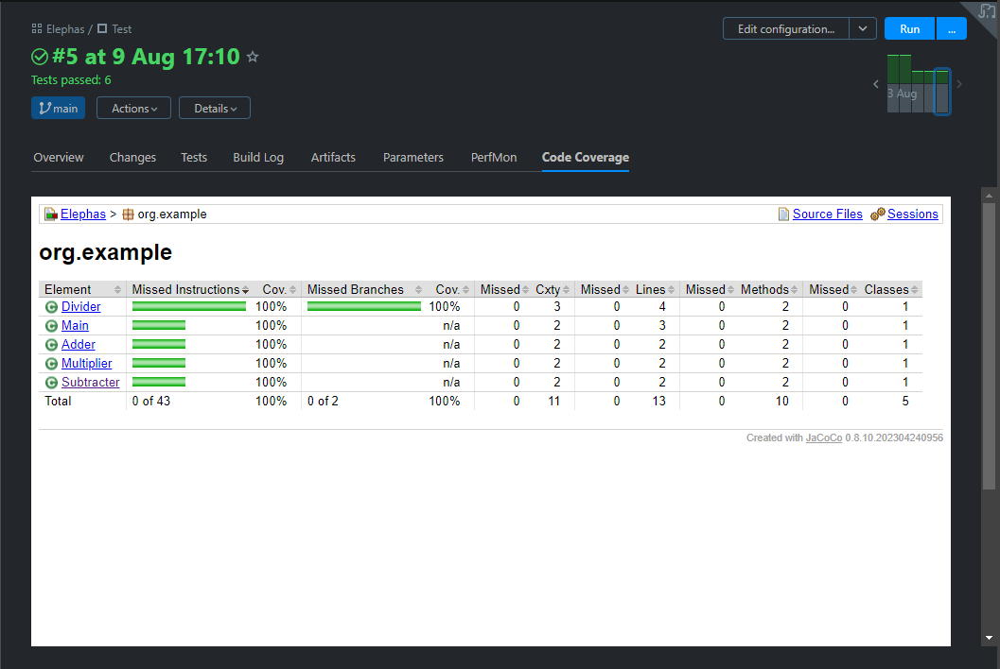
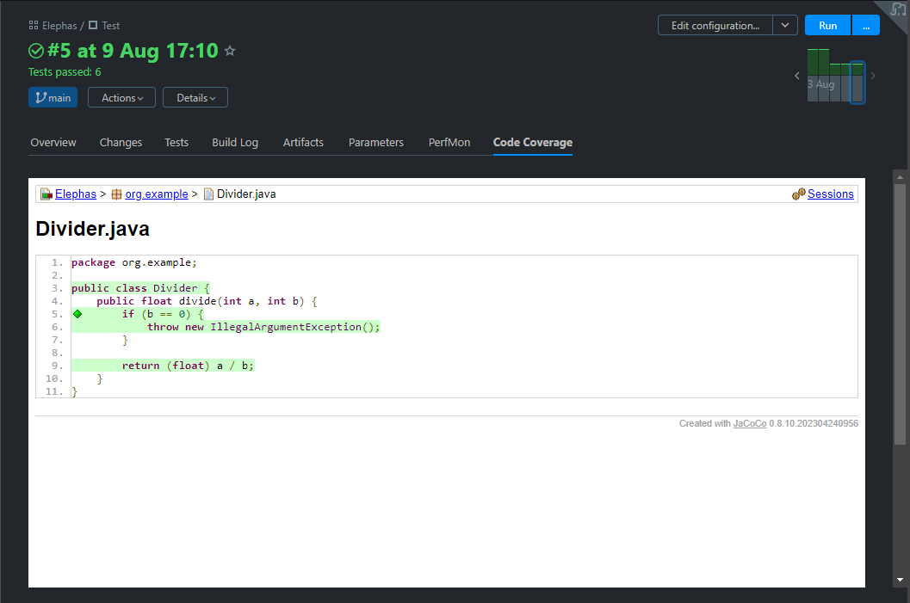

<h1 align="center">Elephas</h1>

<h3 align="center">Showcase of a multi-project setup using gradle<br/>featuring code coverage and dockerized Teamcity pipeline</h3>

## Table of Contents
1. [Project Structure](#project-structure)
2. [Tests](#tests)
3. [Gradle Plugin](#gradle-plugin)
4. [Teamcity](#teamcity)
5. [Self-hosting](#self-hosting)

## Project structure

````
------------------------------------------------------------
Root project 'elephas'
------------------------------------------------------------

Root project 'elephas'
\--- Project ':modules'
     +--- Project ':modules:adder'
     +--- Project ':modules:divider'
     +--- Project ':modules:multiplier'
     \--- Project ':modules:subtracter'
````

## Tests

Each subproject contains a unit test which test their respective function (adding, subtracting, multiplying, dividing).

```shell
PS C:\GitHub\SirTimme\elephas> gradle test

MainTest > mainPrintHelloWorld() "PASSED"
AdderTest > testAdd() "PASSED"
DividerTest > testDivide() "PASSED"
DividerTest > testWhenDiscNull() "PASSED"
MultiplierTest > testMultiply() "PASSED"
SubtracterTest > testSubtract() "PASSED"
```

## Gradle Plugin

Each subproject implements the `org.example.testing` plugin. The plugin uses the `java` plugin to be able to modify the `gradle test` command and adds the JUnit dependency. The plugin looks the following:
```kt
plugins {
    java
}

repositories {
    mavenCentral()
}

dependencies {
    testImplementation("org.junit.jupiter:junit-jupiter-api:5.9.1")
    testRuntimeOnly("org.junit.jupiter:junit-jupiter-engine:5.9.1")
}

tasks.test {
    useJUnitPlatform()
}
```

## Teamcity

When a commit gets pushed to this repo, the Teamcity pipeline starts and executes a fresh build of the project.\
As a second step the pipeline tests the project with coverage metrics using Jacoco. The results look the following:



The `Code Coverage` tab provides a detailed overview over each class with their respective unit tests and code coverage:



It is even possible to inspect a specific class to look at the covered code lines:



The green diamond says that both branches created by the if statement are covered.

## Self hosting

> [!IMPORTANT]
> This directory structure is needed for elephas to run:
> ```
> /
> ├── docker-compose.yml
> └── .env
> ```

The `.env` file needs the following entries:

```
POSTGRES_DB=                                # the database name of your choice
POSTGRES_USER=                              # the database username of your choice
POSTGRES_PASSWORD=                          # the database password of your choice
SERVER_URL=http://teamcity-server:8111
TEAMCITY_VERSION=2023.05.4
POSTGRES_VERSION=15.4
```

The `docker-compose.yml` configures the following services:
- postgres database for data storage
- teamcity-server instance
- teamcity-agent for executing the jobs

```yaml
version: '3.8'

name: elephas
services:
  teamcity-database:
    image: postgres:${POSTGRES_VERSION}
    environment:
      POSTGRES_DB: ${POSTGRES_DB}
      POSTGRES_USER: ${POSTGRES_USER}
      POSTGRES_PASSWORD: ${POSTGRES_PASSWORD}
    ports:
      - "5432:5432"
    volumes:
      - pg-data:/var/lib/postgresql/data

  teamcity-server:
    image: jetbrains/teamcity-server:${TEAMCITY_VERSION}
    ports:
      - "8111:8111"
    volumes:
      - server-data:/data/teamcity_server/datadir
      - server-logs:/opt/teamcity/logs
    depends_on:
      - teamcity-database

  teamcity-agent:
    image: jetbrains/teamcity-agent:${TEAMCITY_VERSION}
    privileged: true
    environment:
      SERVER_URL: ${SERVER_URL}
      DOCKER_IN_DOCKER: start
      AGENT_NAME: agent_47
    volumes:
      - agent-47-conf:/data/teamcity_agent/conf

volumes:
  pg-data:
  server-data:
  server-logs:
  agent-47-conf:
```